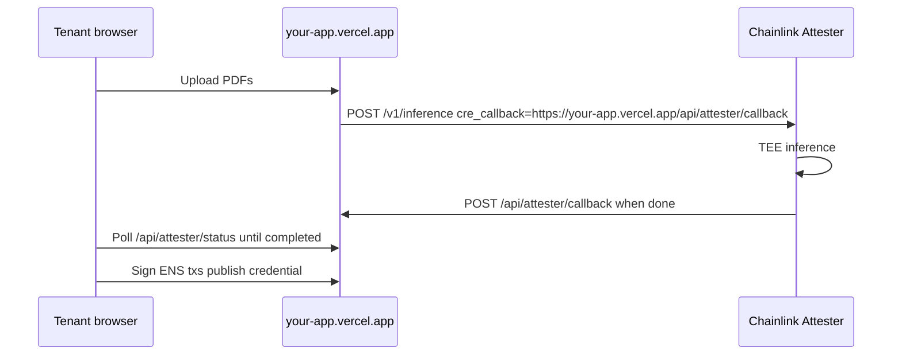

# zkCredentials

Privacy-preserving tenant screening for rental applications. Sensitive PDFs are analyzed by the **Chainlink Confidential AI Attester** inside a TEE. **World ID** prevents duplicate credentials per human. Screening conclusions and cryptographic proof anchors are stored on **ENS text records** — landlords never see raw documents.

## Problem

Landlords typically require passport copies, bank statements, and pay stubs during screening. That oversharing exposes legal identity, exact income, and account details before a lease is signed. zkCredentials replaces raw document disclosure with a portable screening credential.

**Jane Sybil example:** Without World ID, Jane could create `jane1.eth`, `jane2.eth`, `jane3.eth` with different fabricated docs. World ID nullifier gating ensures one credential per unique human — without revealing Jane's legal name to landlords.

## Architecture

```
Tenant: World ID → upload PDFs (base64) → POST /api/attester/submit
  → Chainlink Attester POST /v1/inference (TEE)
  → cre_callback → CRE Go workflow (parse + score + optional on-chain write)
  → poll /api/attester/status → attestation + digests
  → publish 20 ENS text records on screening.{name}.eth
  → share link + rotate payment alias

Landlord: /verify?ensName=screening.alice.eth → live ENS read
```

## Prize tracks

| Track | Implementation |
|-------|----------------|
| **Chainlink Confidential AI Attester** | `/v1/inference` + `cre_callback` + `transcriptHash` / `documentDigest` + `TenantCredentialGate.sol` |
| **ENS Most Creative** | Verifiable credentials in text records; zk proof anchors; rotating payment alias; subname access tokens |
| **World ID** | Sybil resistance before Attester run; `humanVerified` at publish |

### ENS creative features (from prize excerpt)

> *"Store verifiable credentials or zk proofs in text records. Build privacy features with auto-rotating addresses on each resolution. Use subnames as access tokens. Surprise us!"*

- **zk proofs:** `transcriptHash`, `documentDigest`, `credentialCommitment`, World ID nullifier
- **Rotating addresses:** `zkcred.v1.rotatingPaymentAddr` refreshed on each landlord share
- **Subname access token:** credential lives on `screening.{tenant}.eth`, not primary ENS name

## Prerequisites

1. **CRE CLI** v1.19+ — `curl -sSL https://app.chain.link/cre/install.sh | bash`
2. **Go 1.21+**
3. **INFERENCE_API_KEY** from the Chainlink desk
4. **ngrok** (or cloudflared) for Scenario 2 Attester callback
5. **World ID app** at [developer.world.org](https://developer.world.org)
6. **WalletConnect project ID**
7. **Alchemy RPC** for Sepolia (or mainnet)
8. **ENS name** you own (Sepolia or mainnet)
9. **Foundry** (optional) — deploy `TenantCredentialGate.sol`

## Setup

```bash
cp .env.local.example .env.local
# Fill in INFERENCE_API_KEY, CRE_CALLBACK_URL, World ID, RPC, WalletConnect

npm install
cd cre-workflow && go mod tidy
```

### Key environment variables

| Variable | Description |
|----------|-------------|
| `INFERENCE_API_KEY` | Chainlink Confidential AI Attester API key (desk) |
| `CHAINLINK_ATTESTER_URL` | Default `https://confidential-ai-dev-preview.cldev.cloud` |
| `CRE_CALLBACK_URL` | ngrok URL + `/trigger` (CRE) or `/api/attester/callback` (Next.js) |
| `CRE_TRIGGER_FORWARD_URL` | Optional `http://localhost:2000/trigger` to forward callbacks to CRE |
| `CRE_ETH_PRIVATE_KEY` | Sepolia wallet for `cre simulate --broadcast` |
| `USE_CRE_FIXTURE=true` | Dev fallback: Scenario 1 fixture without live Attester |
| `NEXT_PUBLIC_TENANT_CREDENTIAL_GATE_ADDRESS` | Deployed gate contract |

**Security:** never commit `.env.local` or API keys.

## Run locally

```bash
npm run dev
```

- Tenant flow: [http://localhost:3000](http://localhost:3000)
- Landlord verify: [http://localhost:3000/verify](http://localhost:3000/verify)

Set `USE_CRE_FIXTURE=true` to demo without ngrok (uses local CRE callback fixture).

## Deploy to Vercel (recommended — no ngrok)

On Vercel, **`CRE_CALLBACK_URL` is optional**. The app auto-sets:

`https://<your-vercel-domain>/api/attester/callback`



### Vercel environment variables

In **Project → Settings → Environment Variables**, add:

| Variable | Required | Notes |
|----------|----------|-------|
| `INFERENCE_API_KEY` | Yes | Server only — not `NEXT_PUBLIC_` |
| `CHAINLINK_ATTESTER_URL` | Optional | Default sandbox URL is fine |
| `NEXT_PUBLIC_WORLD_APP_ID` | Yes | |
| `WORLD_RP_ID` | Yes | Server only |
| `RP_SIGNING_KEY` | Yes | Server only |
| `NEXT_PUBLIC_WALLETCONNECT_PROJECT_ID` | Yes | |
| `NEXT_PUBLIC_ENS_CHAIN_ID` | Yes | `11155111` for Sepolia |
| `ALCHEMY_RPC` | Yes | Server ENS reads |
| `NEXT_PUBLIC_ALCHEMY_RPC` | Optional | Same URL as above |

**Do not set on Vercel:**

- `USE_CRE_FIXTURE=true` — CRE CLI is not available serverless
- `CRE_CALLBACK_URL` — unless you use a custom domain (then set `https://yourdomain.com/api/attester/callback`)
- `NEXT_PUBLIC_TENANT_CREDENTIAL_GATE_ADDRESS` — optional gate contract (skip)

### After deploy checklist

1. **World ID:** add your Vercel URL to allowed origins in [developer.world.org](https://developer.world.org)
2. **WalletConnect:** allow your Vercel domain in Cloud settings if prompted
3. **Test callback route:** `curl -X POST https://YOUR-APP.vercel.app/api/attester/callback -H "content-type: application/json" -d '{"id":"test","status":"failed"}'` → should return JSON (not 404)
4. **Run tenant flow** on production URL with real PDFs
5. **Landlord verify** at `https://YOUR-APP.vercel.app/verify`

### Vercel limitations

- **SQLite nullifiers** (World ID sybil gate) reset on cold starts — sybil blocking may be unreliable in production; fine for demo
- **ENS writes** still happen from the tenant's wallet (need Sepolia ETH + ENS name)
- Record **Scenario 2** with local CRE + ngrok separately if judges want terminal footage

## Chainlink Attester — Scenario 1 (local)

```bash
cd cre-workflow
go test ./...
cre workflow simulate . --target staging-settings --non-interactive \
  --trigger-index 0 --http-payload ./simulation/callback-payload.json
```

Expected: `transcriptHash` and screening fields in `Workflow Simulation Result`.

## Chainlink Attester — Scenario 2 (E2E, for judges)

**Terminal 1** — start CRE HTTP trigger:

```bash
cd cre-workflow
cre workflow simulate . --broadcast --non-interactive
```

**Terminal 2** — expose port 2000:

```bash
ngrok http 2000
export CRE_CALLBACK_URL="https://<id>.ngrok-free.dev/trigger"
export INFERENCE_API_KEY="your_key"
```

**Terminal 3** — submit inference:

```bash
chmod +x scripts/scenario2-attester.sh
./scripts/scenario2-attester.sh
```

Record terminal output showing `queued` → callback logs with `transcriptHash` + `documentDigest`.

## Deploy on-chain consumer (optional)

```bash
source .env.local
chmod +x scripts/deploy-gate.sh
./scripts/deploy-gate.sh
```

Update `cre-workflow/config.staging.json` `consumerAddress` and `.env.local` `NEXT_PUBLIC_TENANT_CREDENTIAL_GATE_ADDRESS`.

MockKeystoneForwarder (simulation): `0x15fC6ae953E024d975e77382eEeC56A9101f9F88`

Query: `cast call $GATE "canScreen(address)(bool)" $TENANT_ADDRESS`

## Screening credential fields

Landlord sees (on `screening.{name}.eth`):

| Field | Meaning |
|-------|---------|
| `humanVerified` | World ID uniqueness (not legal identity) |
| `documentOwnershipVerified` | Passport anchors bank + payroll ownership |
| `documentsConsistent` | Financial docs align internally |
| `incomeVerified` / `incomeRange` | Meets threshold, bucketed range |
| `employmentStable` | Same employer 3+ months |
| `transcriptHash` / `documentDigest` | Chainlink Attester cryptographic anchors |
| `rotatingPaymentAddr` | Fresh alias per landlord share |

**Never stored:** legal name, passport number, exact salary, account numbers.

## Judge demo script (10 min)

1. **Terminal:** `curl POST /v1/inference` → `status: queued`
2. **Terminal:** CRE callback logs `transcriptHash`, `documentDigest`
3. **Web:** Tenant World ID → upload PDFs → publish to `screening.alice.eth`
4. **Web:** Generate landlord share link + rotating payment alias
5. **Web:** Landlord verifies subname — conclusions + digests, no PDFs
6. **Web:** Second World ID credential blocked ("This human already has a credential")

## Project structure

```
app/api/attester/     Attester submit, status, callback routes
contracts/            TenantCredentialGate.sol
cre-workflow/         Go CRE callback handler + score.go
lib/                  attester, ens, parse-callback, inference-store
scripts/              Scenario 2 curl + gate deploy
```

## Limitations

- Full Attester → CRE callback requires a publicly reachable URL (ngrok for local demo; not Vercel serverless)
- SQLite nullifiers and inference store are local-only
- Subname writes require ENS permissions on `screening.{name}.eth`
